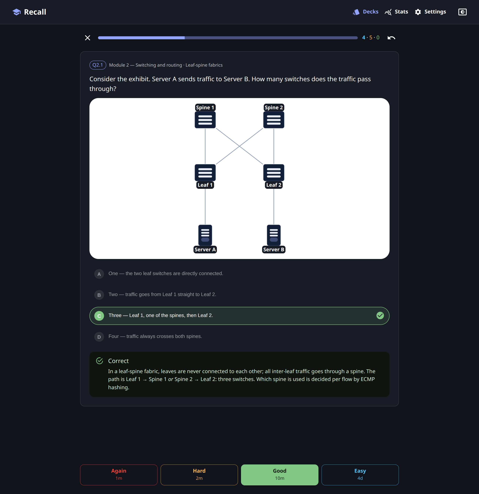
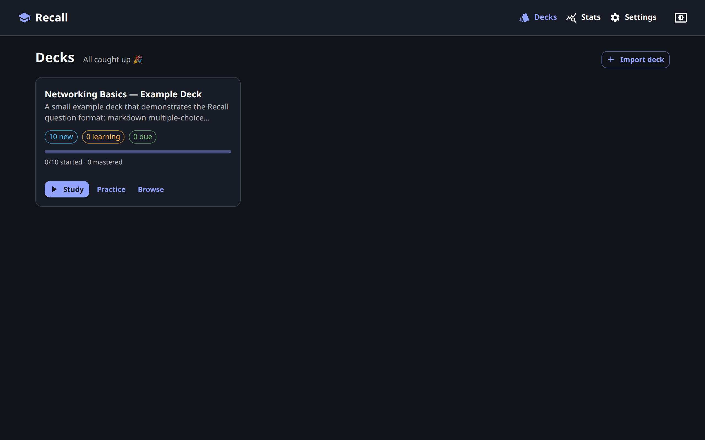
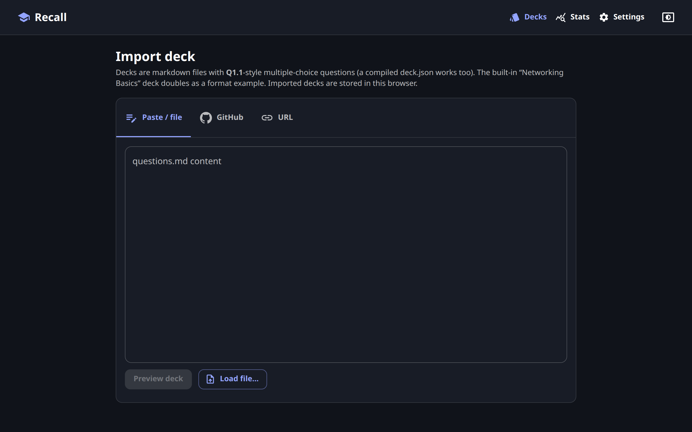
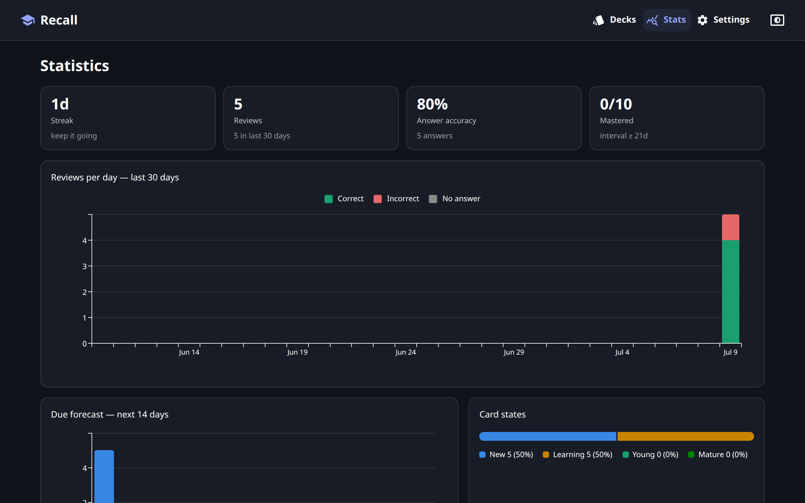

# Recall

**Turn markdown files into study decks — spaced repetition, multiple choice, and network-diagram exhibits, right in your browser.**

### ▶️ [Open Recall](https://flosch62.github.io/recall/)

No account or install required. On Android Chrome, you can install Recall from the browser menu for a standalone app experience; your study progress and imported decks are stored in your browser and never leave your device.

<p align="center">
  
</p>

## What you can do

- **Study with spaced repetition** — Anki-style scheduling (Again / Hard / Good / Easy) decides when each question comes back, so you spend time on the cards you actually forget.
- **Answer real multiple-choice questions** — pick an option, get instant feedback and an explanation. Accuracy is tracked separately from the schedule.
- **See exhibits like in the real exam** — questions can include terminal output and auto-drawn network topology diagrams (spines, leaves, servers, LAG/eBGP links…).
- **Practice without pressure** — cram mode with module filters, shuffle, "weakest first" and retry-wrong never touches your review schedule.
- **Level up in Quest mode** — a Duolingo-style learning tree: summary checkpoints teach essential concepts before bite-sized question lessons, missed questions repeat until you get them right, and stars, XP, levels, a daily goal and streaks keep you coming back. Quest answers count toward shared progress and accuracy, but never touch your review schedule.
- **Browse and search** every question with module/state filters and per-card scheduling details.
- **Keep your streak** — stats show activity per day, Quest progress, a due forecast, card states and per-module accuracy.

<p align="center">
  
</p>

## Bring your own decks

Recall ships with a small example deck. The interesting part is importing your own — **Decks → Import deck**:

| Method | How |
|---|---|
| 📋 **Paste / file** | Paste `questions.md` content or load a local `.md` / `.json` file |
| 🐙 **GitHub** | Paste a link to a repo, folder or file — e.g. `https://github.com/user/repo/tree/main/decks/my-deck`. Recall finds the `questions.md` on the default branch |
| 🔗 **URL** | Any direct link to a `questions.md` or compiled `deck.json` (the server must allow CORS — raw.githubusercontent.com and most static hosts do) |

<p align="center">
  
</p>

Good to know:

- Imported decks live in your browser (IndexedDB). You can **update them from their source** or remove them on the deck page.
- Progress is keyed by deck ID + question ID — re-importing or updating a deck with the same ID **keeps your study progress**.
- Image exhibits are loaded relative to the source URL, so decks imported from GitHub/URL can include images.

## Track your progress

Every answer feeds your statistics: streak, activity per day, Quest progress, a 14-day due forecast and how many cards you've mastered. Back up or sync between devices with **Settings → Export / Import progress** (merge-aware, safe for two devices).

<p align="center">
  
</p>

Keyboard shortcuts while studying: `A–D` / `1–4` answer · `Space` reveal/confirm · `1–4` grade · `U` undo.

## Write your own deck

A deck is one markdown file. Titles become modules, `**Q1.1**`-style questions become cards — the bundled
[example deck](public/decks/networking-basics/questions.md) shows everything, including exhibits:

```markdown
# Deck title

Intro paragraph → becomes the deck description.

## Module 1 — First module title

### Optional context heading shown above each question

**Q1.1** Which statement about UDP is correct?

- A. It retransmits lost datagrams after a timeout.
- B. It establishes a connection with a three-way handshake.
- C. It provides no delivery guarantee and no flow control.
- D. It guarantees in-order delivery using sequence numbers.

<details><summary>Answer</summary>

**C** — UDP is connectionless and best-effort: no handshake, no
acknowledgements, no retransmission, no ordering.

</details>
```

Quest-only summary checkpoints can be placed before a question that starts a Quest lesson. Their
stable IDs preserve completion when a deck is updated, and the source comment keeps authored
teaching material auditable without displaying it to learners:

```markdown
### Checkpoint routing-foundations — Connect the control plane to forwarding

<!-- Sources: pages 30–38 -->

#### Essentials
- The underlay provides routed reachability between tunnel endpoints.
- BGP distributes reachability without extending a Layer 2 failure domain.

#### Key takeaway
VXLAN carries overlay traffic, while EVPN supplies the control-plane reachability that makes forwarding efficient.
```

Checkpoints appear only in Quest mode. Each one teaches the essential concepts exercised by the
question lesson immediately after it and ends with a short conclusion. Completing one unlocks the
next path step but awards no XP, stars, accuracy, or streak credit. Put each checkpoint immediately
before the first question of an existing lesson; the deck validator reports anchors that would
otherwise fall inside a lesson.

Exhibits go inside the question body as fenced code blocks:

- ` ```cli ` — rendered as terminal output
- ` ```topology ` — a small JSON DSL rendered as a network diagram: `nodes`
  (`kind`: cloud/superspine/spine/leaf/server/host/router/vm, optional `label`, `as`, `notes`),
  `links` (`from`/`to`, optional `label`, `fromEnd`/`toEnd`, `kind`: link/ebgp/lag/tunnel/down),
  `groups` (AS boxes) and `callouts`
- `` — images, resolved relative to the deck's source URL

Write "Consider the exhibit." in the question text when it has one — the parser warns you if they don't match, both at build time and in the import preview. Raw `<tokens>` in text are fine; everything is HTML-escaped before rendering.

## Development

React 19 + Vite + MUI 7, decks compiled by a small build script (Node ≥ 22.18 — it imports the TypeScript parser via type stripping, the same parser the browser uses for imports).

```sh
pnpm install
pnpm dev        # parses decks, serves on :5173
pnpm build      # typecheck + production build into dist/
pnpm decks      # re-parse decks only (run after editing questions.md)
```

Bundled decks live in `public/decks/<deck-id>/questions.md`; drop in a folder and re-run `pnpm decks`.

```
├── .github/workflows/        # deploys dist/ on push to main
├── scripts/build-decks.mjs   # questions.md → deck.json + index.json (runs pre-dev/build)
├── public/decks/<deck-id>/   # bundled deck sources
├── docs/screenshots/         # README images
└── src/
    ├── lib/                  # deck parser, imported-deck store (IndexedDB), srs
    │                         # scheduler, session queue, progress store, stats
    ├── components/           # question card, exhibits, grade bar, layout, …
    └── pages/                # decks, deck, study, practice, browse, import, stats, settings
```
